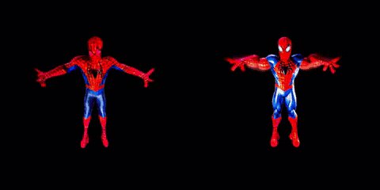
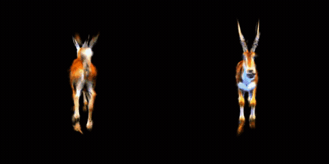
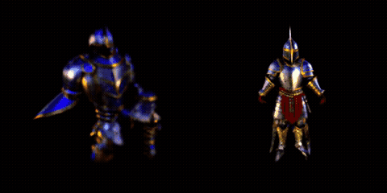
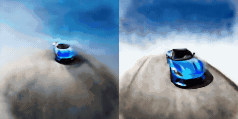
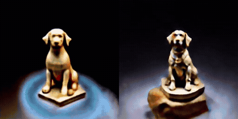
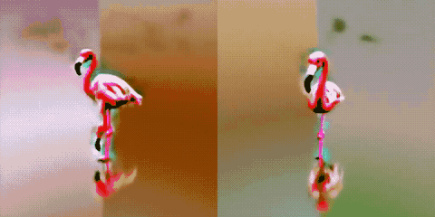
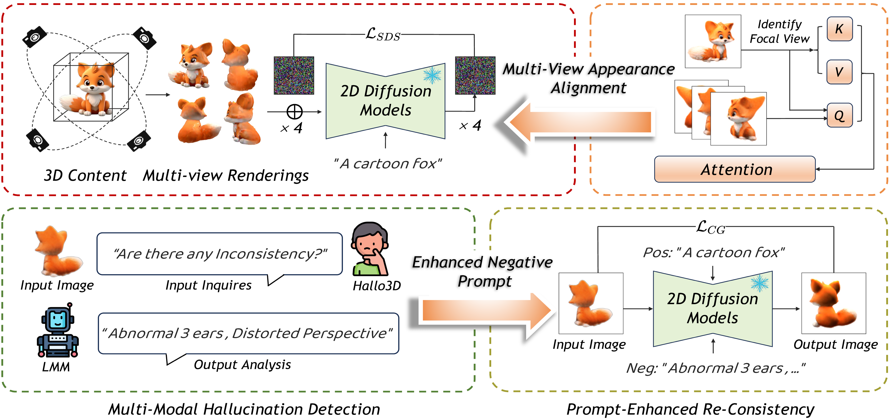

# [Hallo3D] Multi-Modal Hallucination Detection and Mitigation for Consistent 3D Content Generation

[](https://proceedings.neurips.cc/paper_files/paper/2024/file/d75660d6eb0ce31360c768fef85301dd-Paper-Conference.pdf)
[](https://wafer-bob.github.io/Hallo3D-4D/)
[](https://openreview.net/forum?id=pqi4vqBYXW)
[](https://www.python.org/)
[](https://github.com/threestudio-project/threestudio)

Official implementation of the NeurIPS 2024 paper:

> **Hallo3D: Multi-Modal Hallucination Detection and Mitigation for Consistent 3D Content Generation**
> Hongbo Wang, Jie Cao, Jin Liu, Xiaoqiang Zhou, Huaibo Huang, Ran He
> *Advances in Neural Information Processing Systems (NeurIPS), 2024*
> [[Paper]](https://proceedings.neurips.cc/paper_files/paper/2024/file/d75660d6eb0ce31360c768fef85301dd-Paper-Conference.pdf) [[OpenReview]](https://openreview.net/forum?id=pqi4vqBYXW) [[Project Page]](https://wafer-bob.github.io/Hallo3D-4D/)

<p align="center">
  
  
  
</p>
<p align="center">
  
  
  
</p>
<p align="center">
  <em>Text-to-3D generation. In each clip: <b>left = baseline</b> · <b>right = + Hallo3D (ours)</b>. Tuning-free.</em>
</p>

## News

- **2026-07-15** — [**Hallo4D**](https://github.com/wafer-bob/Hallo4D), the next work in the Hallo series on consistency-aware spatio-temporal (3D + 4D) generation, is released — [arXiv](https://arxiv.org/abs/2607.12752) · [project page](https://wafer-bob.github.io/Hallo3D-4D/).
- **2026-07-14** — Code released.
- **Note on timing.** We held the code back while working on [**Hallo4D**](https://github.com/wafer-bob/Hallo4D), the next work in the Hallo series; this release is the cleaned-up implementation. Thanks for your patience.

---

## Highlights

<p align="center">
  
</p>

- 🔌 **Tuning-free plug-in** — hooks into the SDS guidance of existing 3D generation frameworks; no retraining, no architectural changes.
- 🧠 **Generation–detection–correction** — appearance attention aligns color/texture across views; an LMM (LLaVA-v1.6) detects hallucinations (e.g. the Janus problem) and distills them into an enhanced negative prompt `P_E^-`, which drives a selective re-consistency loss `L_CG`.
- 🧩 **Framework-agnostic** — one implementation covers **text-to-3D** (DreamFusion, GaussianDreamer, SJC, Magic3D) and **image-to-3D** (Zero-1-to-3, DreamGaussian), all via [threestudio](https://github.com/threestudio-project/threestudio)-ecosystem plug-ins.

---

## Table of Contents
1. [Installation](#1-installation)
2. [Pretrained Models](#2-pretrained-models)
3. [LMM Detection Server (Module B)](#3-lmm-detection-server-module-b)
4. [Text-to-3D](#4-text-to-3d)
5. [Image-to-3D](#5-image-to-3d)
6. [Practical Notes: `align_mode` and High-CFG SDS](#6-practical-notes-align_mode-and-high-cfg-sds)

## Repository Layout

```
Hallo3D/
├── threestudio-hallo3d/                 # threestudio extension (symlink into threestudio/custom/)
│   ├── guidance/hallo3d_sd_guidance.py       # hallo3d-sd-guidance: all three modules on SD 2.1 SDS
│   ├── guidance/hallo3d_zero123_guidance.py  # hallo3d-stable-zero123-guidance (image-to-3D)
│   ├── utils/appearance_attn.py              # Module A for diffusers UNets (Eq. 4)
│   ├── utils/appearance_attn_ldm.py          # Module A for LDM/CompVis UNets (zero123 family)
│   ├── utils/lmm_client.py                   # Module B client: two-round inquiry + P_E^- parsing (Eq. 5)
│   ├── utils/sd_reconsist.py                 # Module C with a standalone SD 2.1 (image-driven L_CG)
│   └── configs/                              # ready-to-run configs for 5 baselines
│       ├── hallo3d-gaussiandreamer.yaml
│       ├── hallo3d-dreamfusion-sd.yaml
│       ├── hallo3d-sjc.yaml
│       ├── hallo3d-magic3d-coarse-sd.yaml
│       └── hallo3d-zero123.yaml
├── lmm_server/
│   ├── serve_lmm.py                     # local LLaVA-v1.6 HTTP service (Module B server, stdlib only)
│   └── mock_lmm_server.py               # mock server for smoke tests
├── dreamgaussian/                       # official DreamGaussian + our main_hallo3d.py (plug-and-play)
├── assets/pipeline.png             # pipeline figure
├── scripts/
│   ├── env.sh                           # common environment variables
│   └── run_pair.sh                      # one prompt: baseline vs. +Hallo3D
└── tests/
    ├── test_appearance_attn_2d.py       # 2D sanity check for Module A
    └── vis_reconsist.py                 # visualization of Module C inversion/re-sampling
```

### Method ↔ Code Map

| Paper | Implementation |
|---|---|
| Sec. 3.2 Multi-view Appearance Alignment (Eq. 4) | `utils/appearance_attn.py` — UNet self-attention K/V aligned to the focal view. The focal view is the first view with Fovy > 120% of the default 40° (= 48°, Appendix A), else the max-Fovy view. `align_mode=replace` is the literal Eq. 4 (full K/V replacement); `align_mode=extend` is a mutual-attention variant (K/V = [own; focal]) — see [§6](#6-practical-notes-align_mode-and-high-cfg-sds) for when each applies |
| Sec. 3.3 Multi-modal Hallucination Detection (Eq. 5) | `utils/lmm_client.py` + `lmm_server/serve_lmm.py` — Appendix A inquiry template with a one-shot output format; `P_E^-` extracted by regex, `None` returned when the answer is semantically incomplete |
| Sec. 3.4 Prompt-Enhanced Re-consistency (Eq. 6–7) | `guidance/hallo3d_sd_guidance.py::reconsist_images` — DDIM inversion (scale = 1, positive prompt) → CFG re-sampling with the null prompt replaced by `P_E^-` + a general negative prompt (scale = 7.5) → image-space MSE |
| Eq. 8 selective weighting | `loss_cg` is added only when the LMM returns a non-`None` `P_E^-`; `lambda_cg = w = 0.1` (Sec. 4.5) |
| Appendix B cost optimization | `cg_start_step` (GaussianDreamer: 1000/1200, DreamFusion: 2200/2500), `cg_interval = 4`; all baselines use `batch_size = 4` with 1/4 of the original iterations |

## 1. Installation

Hallo3D is a plug-in: install [threestudio](https://github.com/threestudio-project/threestudio) first, then link this repository's extension into `threestudio/custom/`.

```bash
# 1) threestudio (follow its README for the base environment)
git clone https://github.com/threestudio-project/threestudio
cd threestudio && pip install -r requirements.txt && cd ..

# 2) this repository
git clone https://github.com/wafer-bob/Hallo3D
ln -s "$(pwd)/Hallo3D/threestudio-hallo3d" threestudio/custom/threestudio-hallo3d

# 3) extensions required by the GaussianDreamer baseline
git clone https://github.com/cxh0519/threestudio-gaussiandreamer threestudio/custom/threestudio-gaussiandreamer
git clone https://github.com/DSaurus/threestudio-shap-e threestudio/custom/threestudio-shap-e

# 4) Module B server dependency (any recent transformers with LLaVA support)
pip install "transformers>=4.45" accelerate
```

Point `scripts/env.sh` at your installation (or export the variables yourself):

```bash
export THREESTUDIO_DIR=/path/to/threestudio     # default: ../threestudio
export PYTHON=python                             # interpreter for training/eval
export LMM_PYTHON=python                         # interpreter for the LMM server (may be a separate env)
```

Tested on **Python 3.12 + PyTorch 2.6 (CUDA 11.8) + diffusers 0.24 + transformers 4.x**, single A100 80 GB per run (training 20–35 GB at `batch_size=4`; the LLaVA detection server runs on its own GPU — ~27 GB for the 13B variant, ~70 GB for 34B).

## 2. Pretrained Models

Hallo3D is **tuning-free** — every model below is an off-the-shelf public checkpoint; there are no Hallo3D weights to download. All models auto-download from the HuggingFace Hub on first use (set `HF_HUB_OFFLINE=1` after caching for fully-offline runs).

| Model | HF id / source | Needed for |
|---|---|---|
| Stable Diffusion 2.1-base | `stabilityai/stable-diffusion-2-1-base` | SDS guidance (text-to-3D) + Module C |
| LLaVA-v1.6 | `llava-hf/llava-v1.6-34b-hf` (default; `-vicuna-13b-hf` / `-7b-hf` also work) | Module B detector |
| Stable-Zero123 | `stable_zero123.ckpt` → `threestudio/load/zero123/` ([download](https://huggingface.co/stabilityai/stable-zero123)) | image-to-3D (threestudio) |
| Zero123-XL (diffusers) | `ashawkey/zero123-xl-diffusers` | image-to-3D (DreamGaussian) |
| Shap-E | auto-fetched by `threestudio-shap-e` | GaussianDreamer initialization |

## 3. LMM Detection Server (Module B)

Module B runs as a standalone HTTP service so the (large) LMM occupies its own GPU and can be shared by many training runs. It needs only `transformers` — no web-framework dependency.

```bash
CUDA_VISIBLE_DEVICES=0 python lmm_server/serve_lmm.py --port 39121
# POST /query {"image_b64": <base64 PNG>, "prompt": <inquiry P_I>} -> {"response": ...}
```

Options: `--model-id` (default `llava-hf/llava-v1.6-34b-hf`; smaller variants like `-vicuna-13b-hf` or `-7b-hf` are drop-in for tighter GPU budgets), `--dtype`, `--max-new-tokens`.

For a GPU-free smoke test, `lmm_server/mock_lmm_server.py` serves canned answers on the same protocol.

Every training command below takes the server address via `system.guidance.lmm_server_url=http://127.0.0.1:39121`.

## 4. Text-to-3D

`scripts/run_pair.sh` runs one prompt through a baseline **and** its Hallo3D-enhanced counterpart with otherwise identical hyper-parameters (the only fair-comparison knob: both use `batch_size=4` and 1/4 of the original iterations, per paper Appendix B):

```bash
source scripts/env.sh

# usage: run_pair.sh <framework> <gpu> "<prompt>" [threestudio overrides...]
# framework ∈ {gaussiandreamer, dreamfusion-sd, sjc, magic3d-coarse-sd}
bash scripts/run_pair.sh gaussiandreamer 0 "a majestic lion standing on a rock" \
    system.guidance.lmm_server_url=http://127.0.0.1:39121
```

Or launch a single Hallo3D run directly with threestudio:

```bash
cd $THREESTUDIO_DIR
python launch.py --config custom/threestudio-hallo3d/configs/hallo3d-dreamfusion-sd.yaml \
    --train --gpu 0 system.prompt_processor.prompt="an elegant flamingo standing tall" \
    system.guidance.lmm_server_url=http://127.0.0.1:39121
```

Key guidance options (all overridable on the command line):

| Option | Default | Meaning |
|---|---|---|
| `system.guidance.align_mode` | `extend` | Module A mode; `replace` = literal Eq. 4, `extend` = mutual attention ([§6](#6-practical-notes-align_mode-and-high-cfg-sds)) |
| `system.guidance.lmm_server_url` | — | Module B server address |
| `system.guidance.cg_start_step` / `cg_interval` | per config / `4` | when / how often Module C runs (Appendix B) |
| `system.guidance.lambda_cg` | `0.1` | `w` in Eq. 8 |
| `system.guidance.enable_appearance_alignment` / `enable_hallucination_detection` / `enable_cg_loss` | `true` | per-module switches |

## 5. Image-to-3D

### 5.1 Zero-1-to-3 (threestudio, Stable-Zero123)

Download `stable_zero123.ckpt` into `threestudio/load/zero123/`, prepare an RGBA input per the threestudio image-to-3D instructions, then:

```bash
cd $THREESTUDIO_DIR
python launch.py --config custom/threestudio-hallo3d/configs/hallo3d-zero123.yaml \
    --train --gpu 0 data.image_path=./load/images/hamburger_rgba.png \
    system.guidance.lmm_server_url=http://127.0.0.1:39121
```

Implementation notes: Zero-1-to-3 is an LDM (CompVis) architecture, so Module A patches its 16 `attn1` layers via `utils/appearance_attn_ldm.py`; since zero123 has no text conditioning, Module C runs on a standalone SD 2.1 text-conditioned denoiser (`utils/sd_reconsist.py`), matching the framework-agnostic 2D-diffusion setting of paper Fig. 3. The LMM's object description in the inquiry `P_I` comes from a one-off caption of the reference image (overridable with `system.guidance.scene_prompt=...`).

### 5.2 DreamGaussian

`dreamgaussian/` vendors the [official DreamGaussian](https://github.com/dreamgaussian/dreamgaussian) codebase plus our `main_hallo3d.py`, which integrates all three modules into the stage-1 trainer **without modifying any official file** (install DreamGaussian's own requirements first):

```bash
cd dreamgaussian
python main_hallo3d.py --config configs/image.yaml \
    input=data/csm_luigi_rgba.png save_path=luigi_hallo3d batch_size=4 \
    hallo3d_lmm_url=http://127.0.0.1:39121
# extra keys: hallo3d_cg_start_ratio, hallo3d_cg_interval, hallo3d_align_mode, hallo3d_scene_prompt
```

## 6. Practical Notes: `align_mode` and High-CFG SDS

The literal Eq. 4 (`align_mode=replace`, full K/V replacement in every self-attention layer) interacts badly with the **CFG = 100** used by SDS on latent-space Stable Diffusion: the classifier-free guidance direction of every view collapses onto the focal view's content — equivalent to supervising all views with a single 2D image. We provide a minimal 2D reproduction (`tests/test_appearance_attn_2d.py`): alignment is healthy at CFG 7.5 but collapses at CFG 100.

Consequences in 3D:

- **From-scratch NeRF / volume-grid baselines (DreamFusion, SJC, Magic3D)**: use the default **`align_mode=extend`** — a mutual-attention variant (K/V = [own; focal]) that keeps each view's own K/V as a structural anchor while sharing the focal view's appearance. Semantically still the paper's appearance attention, but robust to the guidance scale.
- **Baselines with a 3D-consistent initialization (GaussianDreamer + Shap-E)**: the literal **`replace`** is safe and yields the larger gain.
- The paper's DreamFusion experiments use DeepFloyd-IF (pixel-space diffusion, CFG ≈ 20), where the collapse effect is much weaker — which is why Eq. 4 is stated in its literal form.

## Citation

```bibtex
@inproceedings{wang2024hallo3d,
  title     = {Hallo3D: Multi-Modal Hallucination Detection and Mitigation for Consistent 3D Content Generation},
  author    = {Wang, Hongbo and Cao, Jie and Liu, Jin and Zhou, Xiaoqiang and Huang, Huaibo and He, Ran},
  booktitle = {Advances in Neural Information Processing Systems (NeurIPS)},
  year      = {2024}
}
```

## Acknowledgements

Hallo3D is implemented as an extension of [threestudio](https://github.com/threestudio-project/threestudio) and plugs into its ecosystem. We thank the threestudio authors and the broader open-source community whose frameworks and pretrained models this work builds on.

## License

This project is released under the [MIT License](LICENSE). Vendored third-party code retains its original license.
